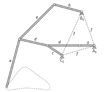
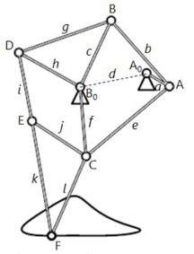

## II.  Bein-Mechanismus

### 1.  Tschebyschew-Lambda-Mechanismus

Der Tschebyschew-Lambda-Mechanismus ist ein Viergelenkmechanismus, der eine Drehbewegung in eine ungefähre geradlinige Bewegung mit ungefähr konstanter Geschwindigkeit umwandelt. Das genaue Design basiert auf Geradheit, Nichtbeschleunigung und Antriebsdrehzahl, die im linearen Teil des gesamten Bogens verwendet werden.

<figure>

#### **Abb. 1:** Tschebyschewlenker und Tschebyschew-Lambda-Mechanismus

</figure>

Der Tschebyschew-Lambda-Mechanismus (Abbildung rechts) ist ein Roberts’sches Ersatzgetriebe, welches aus dem Tschebyschewlenker (Abbildung  links) hervorgeht. [RWT-19, S.613].
Die Gliedlängen der Kurbel a, der Koppel b, der Schwinge c und des Gestelles d sind hierbei in Längeneinheiten. [RWT-19, S.162] 

•	Kurbel        a = 1

•	Koppel       b = 8

•	Schwinge   c = 4

•	Gestell       d = 3

Die umlauffähige Kurbel a, treibt über die Koppel b die Schwinge c an. Eine Besonderheit des Viergelenks besteht darin, dass die Schwinge c mit der Koppel b nicht an deren Endpunkt, sondern an deren Mittelpunkt verbunden ist. Dies ist in Abbildung 3-4 aus der Beziehung b1 = b2 ersichtlich. Eine weitere Besonderheit stellt die Tatsache dar, dass durch die Beziehung c = b1 eine gleichschenklige Kurbelschwinge entsteht. [RWT-19, S.162]

### 2.  Klann linkage

Der Klann-Mechanismus wurde am 5. Februar 1999 von Joseph C Klann erfunden und für den erstmals zu patente angemeldet. Die von ihm erzeugte Gangbewegung ist dem Gang des Tieres mit Beinen nachempfunden.

Sechs Glieder (a, b, c, d, e, f) sind durch axiale Klammern miteinander verbunden. Der Mechanismus wird von einer rotierenden Kurbel a angetrieben. Diese führt das Bein e durch die Pleuelstange d, deren Vorwärts- und Rückwärtsbewegung durch den unteren Kipphebel c begrenzt ist. Die Begrenzung der Vorwärts- und Rückwärtsbewegung des Beines e wird durch den oberen Kipphebel b bereitgestellt. Schließlich beide Die Kurbel a, der obere Kipphebel b und der untere Kipphebel c sind axial mit dem Rahmen f verbunden.

<figure>

#### **Abb. 2:** Klann-Mechanismuns

</figure>
			
Der Mechanismus besteht aus sechs Gliedern. Abbildung 2 [PAT-01,S.1] Diese sind:

•	Die Kurbel *a*

•	Der obere Kipphebel *b*

•	Der untere Kipphebel *c*

•	Der Verbindungsstab *d*

•	Das Bein *e*

•	Der Rahmen *f*

### 3.  Theo Jansens: Strandbeest-Mechanismus

Dieser Mechanismus wurde vom Künstler Theo Jansen entwickelt und wird seitdem verwendet, um Kunstobjekte anzutreiben, die er "Strandbeest" nennt. Der Künstler spricht über seine "Strandbeests".

*„Seit 1990 beschäftige ich mich mit der Schaffung neuer Lebensformen. Nicht Pollen oder Samen, sondern gelbe Kunststoffrohre werden als Grundmaterial dieser neuen Wesen verwendet. Ich mache Skelette, die im Wind laufen können, damit sie nicht essen müssen. Im Laufe der Zeit haben diese Skelette die Elemente wie Sturm und Wasser immer besser überstanden, und schließlich möchte ich diese Tiere in Herden an den Stränden aussetzen, und sie werden ihr eigenes Leben führen.“ [STB-19]*

Bei dem Jansen-Mechanismus (Abbildung 3) handelt es sich um zwei Viergelenkgetriebe (A0ABB0 mit den zugehörigen Gliedern a, b, c, d und A0ACB0 mit den zugehörigen Gliedern a, e, f und d). die zwei Viergelenkgetriebe werden durch die Kurbel A0A bzw. a angetrieben. Der Gliedpunkt E wird mittels der Glieder i und j mit den Gliedpunkten D und C verbunden. Die Länge der Verbindungen ist konstant, sie sind jedoch beweglich mit dem Verbindungspunkt verbunden. Schließlich wird der Term j aufgrund zweier Längen k und l zu einem konstanten Dreieck mit dem Gliedpunkt F erweitert. Die Schreitbewegung wird durch seine bahnkurve dargestellt. [DAN-13, S.476].

<figure>

#### **Abb. 3:** Strandbeest-Mechanismus

</figure>
