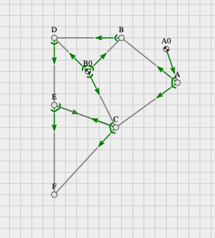

## III.  Analyse des Strandbeest-Mechanismus

### 1.	Theo Jansens: Strandbeest-Mechanismus

#### a.	Generell

Die Anforderungen an das Koppelgetriebe, die eine Gehbewegung erzeugen, können wie folgt ausgedrückt werden: Wenn die Füße den Boden berühren, sollten sie sich in einer geraden horizontalen Linie mit möglichst konstanter Geschwindigkeit bewegen. Natürlich, weil alles relativ ist, wenn der Fuß den Boden berührt, wenn das Strandbeest läuft, bewegt sich nicht der Fuß, sondern die gesamte Maschine. Während der "Vorwärts" -Periode (Fuß in der Luft) sollte die Geschwindigkeit jedoch deutlich höher sein.

#### b.	Koppelkurve

Abhängig von Getriebestruktur und -Geometrie werden jeder Gliedpunkt eine Bahnkurve erstellen. Die Koppelkurve werden dann als Bahnen von Gliedpunkten betrachtet. Die können unterschiedliche Formen haben: gerade Linien, Kreise, Ovale, bohnen-, gurken- und nierenförmige, brotförmige, nierenförmige, herzförmige, zwiebelförmige Bahnen, Achter und mehrfach verschlungene Gebilde anbieten.  Diese unterschiedlichen Formen der Koppelkurven stehen in direktem Verhältnis zu der Lage des Koppelpunktes und die Länge einzelne Glieder. Für den Einsatz in laufenden Maschinen sind jedoch nur die Koppelstellen infrage, die eine nahezu D-förmige Koppelkurve erzeugen.

#### c.	Flachpunkt / Undulationspunkt

Bei der Analyse einer Schreitmaschine ist der Suche eines Punktes mit gerader Führung von großer Bedeutung.
Solche Punkte der Kreispunktkurve, deren Krümmung gerade stationär und Null ist werden als Flachpunkt oder Undulationspunkt bezeichnet. Dies befindet sich im Schnittpunkt der beiden Wendekreise (1. Und 2. Ordnung).

#### 2.	Einsatz in Mec-2

mec2 ist eine in JavaScript geschriebene 2D-Physik-Simulations-Engine. Sie wurde entwickelt, um auf einfache Weise 2D-Mechanismen zum schnellen Skizzieren und Rendern der resultierenden Modelle in einem 2D-Canvas mit g2 zu erstellen. Sie verfügt über ein neues Konzept, bei dem Elemente als Partikel behandelt werden, deren Bewegungen Zwangsbedingungen folgen.
mec2 hat keine Abhängigkeiten für die Simulation und implementiert alle notwendige Infrastruktur selbständig. Zum Rendern des Modells wird die Grafikbibliothek g2 verwendet. Um mehr über g2 zu erfahren, schauen Sie (hier)[goessner.github.io/g2]. Modelle werden im menschen- und maschinenlesbaren JSON-Format beschrieben.
Wir werden nicht auf die Dokumentation von mec-2 eingehen, aber Sie können mehr erfahren, wenn Sie auf diesen Link klicken [https://goessner.github.io/mec2/]. Aber wir werden hier die wesentlichen Punkte beleuchten, die die Implementierung unseres Mechanismus ermöglichen.
-	Nodes: können als Partikel betrachtet werden und werden durch die folgenden Eigenschaften beschrieben ( id, Koordinaten x und y, mögliche Optionen wie base oder idloc).
-	Constraints: definieren die Verbindung zwischen zwei Nodes. Deswegen wäre es überhaupt nicht möglich eine Constraint zu definieren ohne zwei Nodes davor zu definieren.
-	Loads
-	Views: können verwendet werden, um verschiedene Eigenschaften des Modells oder einzelne Elemente des Modells sichtbar zu machen.
-	Shapes: um Elemente mit geometrischen Formen oder Bildern zu stilisieren.

<figure>

#### **Abb. 4:** Ansicht mit mec-2

</figure>