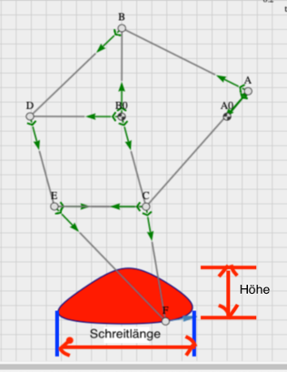
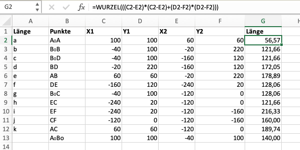
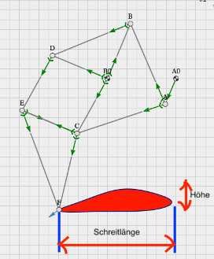

## IV.	Optimierung des Mechanismus

In diesem Teil der Aufgabe wird das Ziel verfolgt den Mechanismus bzw. die Gliedlängen zu ändern, um eine neue Koppelkurve zu gewinnen, die eine längere Schrittweite erreicht. Dabei sollen die in dem Teil Analyse erwähnten Anforderungen erfüllen. 

### 1.	Simulation vor der Optimierung

<figure>

<mec-2 width="500" height="500" grid cartesian nodelabels x0="300" y0="200">
        {
            "nodes": [
                {"id":"A0", "x": 80, "y": 140, "base": true}, 
                {"id":"A", "x": 100, "y": 80},
                {"id":"B0","x": -60, "y": 100, "base": true},
                {"id":"B", "x": 0, "y": 160},
                {"id":"D", "x": -120, "y": 160},
                {"id":"E", "x": -120, "y": 40},
                {"id":"C", "x": -10, "y": 0},
                {"id":"F", "x": -120, "y": -120}
            ],
            "constraints": [
                {"id":"a","p1":"A0","p2":"A","len":{"type":"const"},"ori":{"type":"drive","repeat":100,"Dt":3,"Dz":-1 }},
                {"id":"b","p1":"B0","p2":"B","len":{"type":"const"}},
                {"id":"c","p1":"B0","p2":"D","len":{"type":"const"}},
                {"id":"d","p1":"B","p2":"D","len":{"type":"const"}},
                {"id":"e","p1":"A","p2":"B","len":{"type":"const"}},
                {"id":"f","p1":"D","p2":"E","len":{"type":"const"}},
                {"id":"g","p1":"B0","p2":"C","len":{"type":"const"}},
                {"id":"h","p1":"E","p2":"C","len":{"type":"const"}},
                {"id":"i","p1":"E","p2":"F","len":{"type":"const"}},
                {"id":"k","p1":"C","p2":"F","len":{"type":"const"}},
                {"id":"l","p1":"A","p2":"C","len":{"type":"const"}}
            ],
            "views": [
                {"show": "pos", "of": "F", "as": "trace", "Dt":3, "fill":"orange"},
                {"show": "vel", "of": "F", "as": "vector"}
            ]
        }  
        </mec-2>

#### **Abb. 5:** Ansicht mit mec-2

</figure>

Wie Sie schon in der Dokumentation von mec-2 sehen können, wird für das Schreiben der Code einen Editor gebraucht wie zum Beispiel Visual Code. Zur Visualierung dessen Ergebnis wird einen Browser gebraucht. Die dazu erstellte und geschriebene Code ist:

```HTML
<mec-2 width="500" height="500" grid cartesian nodelabels x0="300" y0="200">
        {
            "nodes": [
                {"id":"A0", "x": 80, "y": 140, "base": true}, 
                {"id":"A", "x": 100, "y": 80},
                {"id":"B0","x": -60, "y": 100, "base": true},
                {"id":"B", "x": 0, "y": 160},
                {"id":"D", "x": -120, "y": 160},
                {"id":"E", "x": -120, "y": 40},
                {"id":"C", "x": -10, "y": 0},
                {"id":"F", "x": -120, "y": -120}
            ],
            "constraints": [
                {"id":"a","p1":"A0","p2":"A","len":{"type":"const"},"ori":{"type":"drive","repeat":100,"Dt":3,"Dz":-1 }},
                {"id":"b","p1":"B0","p2":"B","len":{"type":"const"}},
                {"id":"c","p1":"B0","p2":"D","len":{"type":"const"}},
                {"id":"d","p1":"B","p2":"D","len":{"type":"const"}},
                {"id":"e","p1":"A","p2":"B","len":{"type":"const"}},
                {"id":"f","p1":"D","p2":"E","len":{"type":"const"}},
                {"id":"g","p1":"B0","p2":"C","len":{"type":"const"}},
                {"id":"h","p1":"E","p2":"C","len":{"type":"const"}},
                {"id":"i","p1":"E","p2":"F","len":{"type":"const"}},
                {"id":"k","p1":"C","p2":"F","len":{"type":"const"}},
                {"id":"l","p1":"A","p2":"C","len":{"type":"const"}}
            ],
            "views": [
                {"show": "pos", "of": "F", "as": "trace", "Dt":3, "fill":"orange"},
                {"show": "vel", "of": "F", "as": "vector"}
            ]
        }  
</mec-2>
```

**Ergebnis:** 

Für die von mec-2 erzeugte Koppelkurve ist es sofort festzustellen, dass diese keine D-förmige Kurve erstellt, auch keine Undulationspunkt ist sichtbar. Das heißt, alle erwähnte Anforderungen wurden nicht erfüllt. Die erzeuge Drehrichtung des Fußes ist in der Gegenrichtung zu der von der Kurbel beschriebene Bewegung. Deswegen ist eine Optimierung notwendig.
Hier sind die ausgewählten Längen.

$Länge = \sqrt{(x2-x1)^2+(y2-y1)^2 }$

<figure>

</figure>

### 2.	Erste Optimierung

<figure>
<mec-2 width="500" height="500" grid cartesian nodelabels x0="300" y0="200">
        {
            "nodes": [
                {"id":"A0", "x": 100, "y": 100, "base": true}, 
                {"id":"A", "x": 80, "y": 60},
                {"id":"B0","x": -40, "y": 100, "base": true},
                {"id":"B", "x": -20, "y": 220},
                {"id":"D", "x": -160, "y": 120},
                {"id":"E", "x": -240, "y": 20},
                {"id":"C", "x": -120, "y": 0},
                {"id":"F", "x": -120, "y": -160}
            ],
            "constraints": [
                {"id":"a","p1":"A0","p2":"A","len":{"type":"const"},"ori":{"type":"drive","repeat":100,"Dt":3,"Dz":-1 }},
                {"id":"b","p1":"B0","p2":"B","len":{"type":"const"}},
                {"id":"c","p1":"B0","p2":"D","len":{"type":"const"}},
                {"id":"d","p1":"B","p2":"D","len":{"type":"const"}},
                {"id":"e","p1":"A","p2":"B","len":{"type":"const"}},
                {"id":"f","p1":"D","p2":"E","len":{"type":"const"}},
                {"id":"g","p1":"B0","p2":"C","len":{"type":"const"}},
                {"id":"h","p1":"E","p2":"C","len":{"type":"const"}},
                {"id":"i","p1":"E","p2":"F","len":{"type":"const"}},
                {"id":"k","p1":"C","p2":"F","len":{"type":"const"}},
                {"id":"l","p1":"A","p2":"C","len":{"type":"const"}}
            ],
            "views": [
                {"show": "pos", "of": "F", "as": "trace", "Dt":3, "fill":"red"},
                {"show": "vel", "of": "F", "as": "vector"}
            ]
        }  
        </mec-2>

#### **Abb. 6:** Ansicht mit mec-2

</figure>

Zur Visualierung dessen Ergebnis wird einen Browser gebraucht. Die dazu erstellte und geschriebene Code ist:

```Html
<mec-2 width="500" height="500" grid cartesian nodelabels x0="300" y0="200">
        {
            "nodes": [
                {"id":"A0", "x": 100, "y": 100, "base": true}, 
                {"id":"A", "x": 80, "y": 60},
                {"id":"B0","x": -40, "y": 100, "base": true},
                {"id":"B", "x": -20, "y": 220},
                {"id":"D", "x": -160, "y": 120},
                {"id":"E", "x": -240, "y": 20},
                {"id":"C", "x": -120, "y": 0},
                {"id":"F", "x": -120, "y": -160}
            ],
            "constraints": [
                {"id":"a","p1":"A0","p2":"A","len":{"type":"const"},"ori":{"type":"drive","repeat":100,"Dt":3,"Dz":-1 }},
                {"id":"b","p1":"B0","p2":"B","len":{"type":"const"}},
                {"id":"c","p1":"B0","p2":"D","len":{"type":"const"}},
                {"id":"d","p1":"B","p2":"D","len":{"type":"const"}},
                {"id":"e","p1":"A","p2":"B","len":{"type":"const"}},
                {"id":"f","p1":"D","p2":"E","len":{"type":"const"}},
                {"id":"g","p1":"B0","p2":"C","len":{"type":"const"}},
                {"id":"h","p1":"E","p2":"C","len":{"type":"const"}},
                {"id":"i","p1":"E","p2":"F","len":{"type":"const"}},
                {"id":"k","p1":"C","p2":"F","len":{"type":"const"}},
                {"id":"l","p1":"A","p2":"C","len":{"type":"const"}}
            ],
            "views": [
                {"show": "pos", "of": "F", "as": "trace", "Dt":3, "fill":"red"},
                {"show": "vel", "of": "F", "as": "vector"}
            ]
        }  
        </mec-2>
``` 

**Ergebnis:** 

Im Vergleich zu der vorherigen Simulation lässt sich eine ganz große Änderung beobachten. Wir haben schon eine fast D-förmige Koppelkurve bekommen. Die Drehrichtungen (von der Kurbel und von dem Fuß) stimmen auch schon überein. Hier wurden die vorherigen Längen komplett geändert und angepasst. Hier unten sind die neuen Längen.

Wir kommen jetzt zu der Rechnung (Einschätzung) der Schreitlänge und dessen Höhe.
Für jedes Quadrat haben wir ungefähr 20m. Das heißt:

$Schrittlänge = 9 * 20mm = 180mm$

$Höhe = 3,5 * 20mm = 70mm$

<figure>


#### **Abb. 7:** Analyse der Schreitlänge 1
</figure>

### 3.	Zweite Optimierung

<figure>
<mec-2 width="500" height="500" grid cartesian nodelabels x0="300" y0="200">
 {
            "nodes": [
                {"id":"A0", "x": 100, "y": 100, "base": true}, 
                {"id":"A", "x": 60, "y": 60},
                {"id":"B0","x": -40, "y": 100, "base": true},
                {"id":"B", "x": -20, "y": 220},
                {"id":"D", "x": -160, "y": 120},
                {"id":"E", "x": -240, "y": 20},
                {"id":"C", "x": -120, "y": 0},
                {"id":"F", "x": -120, "y": -160}
            ],
            "constraints": [
                {"id":"a","p1":"A0","p2":"A","len":{"type":"const"},"ori":{"type":"drive","repeat":100,"Dt":3,"Dz":-1 }},
                {"id":"b","p1":"B0","p2":"B","len":{"type":"const"}},
                {"id":"c","p1":"B0","p2":"D","len":{"type":"const"}},
                {"id":"d","p1":"B","p2":"D","len":{"type":"const"}},
                {"id":"e","p1":"A","p2":"B","len":{"type":"const"}},
                {"id":"f","p1":"D","p2":"E","len":{"type":"const"}},
                {"id":"g","p1":"B0","p2":"C","len":{"type":"const"}},
                {"id":"h","p1":"E","p2":"C","len":{"type":"const"}},
                {"id":"i","p1":"E","p2":"F","len":{"type":"const"}},
                {"id":"k","p1":"C","p2":"F","len":{"type":"const"}},
                {"id":"l","p1":"A","p2":"C","len":{"type":"const"}}
            ],
            "views": [
                {"show": "pos", "of": "F", "as": "trace", "Dt":3, "fill":"red"},
                {"show": "vel", "of": "F", "as": "vector"}
            ]
        }  
        </mec-2>

#### **Abb. 8:** Zweite Optimierung

</figure>

Zur Visualierung dessen Ergebnis wird einen Browser gebraucht. Die dazu erstellte und geschriebene Code ist:

```Html
<mec-2 width="500" height="500" grid cartesian nodelabels x0="300" y0="200">
 {
            "nodes": [
                {"id":"A0", "x": 100, "y": 100, "base": true}, 
                {"id":"A", "x": 60, "y": 60},
                {"id":"B0","x": -40, "y": 100, "base": true},
                {"id":"B", "x": -20, "y": 220},
                {"id":"D", "x": -160, "y": 120},
                {"id":"E", "x": -240, "y": 20},
                {"id":"C", "x": -120, "y": 0},
                {"id":"F", "x": -120, "y": -160}
            ],
            "constraints": [
                {"id":"a","p1":"A0","p2":"A","len":{"type":"const"},"ori":{"type":"drive","repeat":100,"Dt":3,"Dz":-1 }},
                {"id":"b","p1":"B0","p2":"B","len":{"type":"const"}},
                {"id":"c","p1":"B0","p2":"D","len":{"type":"const"}},
                {"id":"d","p1":"B","p2":"D","len":{"type":"const"}},
                {"id":"e","p1":"A","p2":"B","len":{"type":"const"}},
                {"id":"f","p1":"D","p2":"E","len":{"type":"const"}},
                {"id":"g","p1":"B0","p2":"C","len":{"type":"const"}},
                {"id":"h","p1":"E","p2":"C","len":{"type":"const"}},
                {"id":"i","p1":"E","p2":"F","len":{"type":"const"}},
                {"id":"k","p1":"C","p2":"F","len":{"type":"const"}},
                {"id":"l","p1":"A","p2":"C","len":{"type":"const"}}
            ],
            "views": [
                {"show": "pos", "of": "F", "as": "trace", "Dt":3, "fill":"red"},
                {"show": "vel", "of": "F", "as": "vector"},
                {"as": "chart", "x": 140, "y": 275, "Dt": 1.9,"show": "wt", "of": "l"}
            ]
        }  
</mec-2>
```

**Ergebnis:**

Nach Anpassung der unterschiedlichen Längen sind wir auf eine sehr gute Verbesserung unserer Koppelkurve. Hier haben wir auch eine längere Schrittlänge und wir haben auch die Höhe reduziert. 

<figure>

</figure>

Wir kommen jetzt zu der Rechnung (Einschätzung) der Schreitlänge und dessen Höhe.
Für jedes Quadrat haben wir ungefähr **20m**. Das heißt:
$Schrittlänge = 11,5 x 20mm = 230mm$
$Höhe = ca. 40mm$

<figure>


#### **Abb. 9:** Analyse der Schreitlänge 2

</figure>

